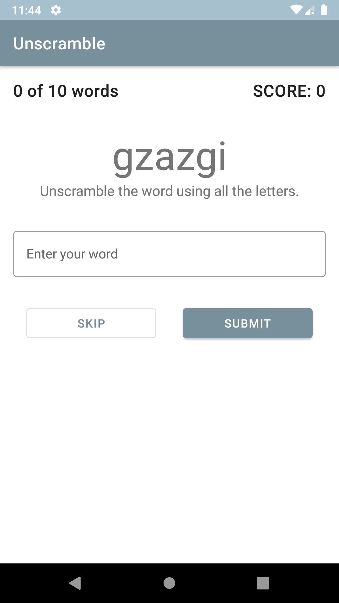

# Unscramble

DiceRoller is an app make in codelab of kotlin from google

DiceRoller is a sample app, where when you click on button, the app generate a random number, this number represents the side of the dice that will appear

